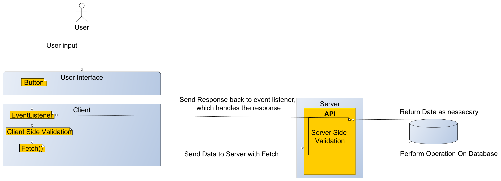

# Client-Server Application - Project Hi-Fi

## Opgavebeskrivelse

Du skal fremstille en webapplikation til en HI-FI webbutik, som præsenterer butikkens produkter inddelt efter kategori. Brugeren af sitet skal nemt og overskueligt kunne finde rundt i de forskellige produkter og kunne fremsøge produkter vha. søgeord.
Du skal fremstille et administrationsmodul til din HI-FI webbutik. Modulet skal være beskyttet af et login-system, så kun butikkens administrator(er) har adgang til modulet.
Du bestemmer og designer selv brugergrænsefladen til systemet.
Alle funktioner skal analyseres og beskrives i en kravspecifikation, som du skal udvikle efter.

### Systemets primære funktioner:

* Oprettelse af nye produkter
* Redigering af eksisterende produkter, herunder priser
* Fjernelse af produkter i systemet

### Systemets sekundære funktioner:

* Profilside, herunder skift password
* Brugeradministration - oprettelse og administration af brugere - evt. roller
* Tilpasning af indhold på forside og kontaktside
* Tilpasning af menu
* Administration af kontakthenvendelser

## Tekniske Krav

### Front-End

Henter data igennem et API fra Back-end delen vha. ```fetch().then().catch()``` og præsenterer så det hentede data igennem user interfacet. 

1. Anvendte Teknologier
    * HTML
    * CSS
    * JavaScript
    * Node.js
    * BootsTrap

### Back-End 

Manipulerer den dynamiske data som ligger i den bagvedliggende database ved en række SQL udtræk. De forskellige operationer gøres tilgængelige i form af en række routes, som kan kaldes efter behov. 

1. Anvendte Teknologier
    * JavaScript
    * Node.js
    * SQL

## Sider og indhold
Det følgende afsnit beskriver hvilke sider systemet skal indeholde, samt sidernes formål, dvs. krav til hvad de enkelte sider skal indeholde. 

* Forside 
* Produktside
* Kontaktside 
 
#### Forsiden 
* Forsidetekst og billeder af produkter
* Visning af ét eller flere udvalgte produkter (kan være de senest oprettede, et tilfældigt produkt eller andet du finder relevant)
 
#### Produktsiden
* Visning af alle produkter inden for en bestemt kategori
* Visning af ét produkt ved klik på et produkt fra listen
* Visning af produkter efter søgning

Alle produkter hentes via et API og udskrives med fetch. Over listen af produkter vises kategoriens titel.
 
#### Kontaktsiden 
* Kontaktsiden indeholder informationer om HI-FI butikken samt en kontaktformular.
* Formulardata indsættes i databasen via et API
* Formularfelter valideres som minimum vha. HTML5 validering
* Besked til brugeren om at formularen er sendt og modtaget
 
#### Alle sider 
* Menu 
* Fritekst-søgefunktion til produkter og producenter (visning på produktsiden) 
* Footer med kontaktinfo 

# Mappe-struktur

## Client-Side
```
Hi-Fi_FE_ALEXANDER_F
|
|____node_modules (folder)
|
|____public (folder)
|    |
|    |____assets (folder)
|    |    |
|    |    |____css (folder)
|    |    |    |
|    |    |    |....slider_css.css (file)
|    |    |    |....style.css (file)
|    |    |    |....style(2).css (file)
|    |    |    |....vertical_dropdown.css
|    |    |
|    |    |
|    |    |____img (folder)
|    |    |    |
|    |    |    |....img.png (file)
|    |    |    |....img.png (file)
|    |    |    |........png (file)
|    |    |
|    |    |____js (folder)
|    |    |    |
|    |    |    |....admin.js (file)
|    |    |    |....login.js (file)
|    |    |    |....messaging.js (file)
|    |    |    |....products.js (file)
|    |    |    |....profile.js (file)
|    |    |    |....register_product.js (file)
|    |    |    |....register.js (file)
|    |    |    |....script.js (file)
|    |    |    |....search_script.js (file)
|    |    |    
|    |    |____sub (folder)
|    |         |
|    |         |____afspillere (folder)
|    |         |    |
|    |         |    |....cd_afspillere.html (file)
|    |         |    |....dvd_afspillere.html (file)
|    |         |    |....plade_afspillere.html (file)
|    |         |
|    |         |____forstaerkere (folder)
|    |         |    |
|    |         |    |....effekt_forstaerkere.html (file)
|    |         |    |....for_forstaerkere.html (file)
|    |         |    |....interne_forstaerkere.html (file)
|    |         |    |....roer_forstaerkere.html (file)
|    |         |
|    |         |____hoejtalere (folder)
|    |         |    |
|    |         |    |....hoejtalere.html (file)
|    |         |
|    |         |....adding_products.html (file)
|    |         |....log_in.html (file)
|    |         |....manage_content.html (file)
|    |         |....messaging.html (file)
|    |         |....products.html (file)
|    |         |....profile_page.html (file)
|    |         |....register.html (file)
|    |
|    |....gitignore (file)
|    |....index.html (file)
|    |....README.md
|        
|....gitignore (file)
|....app.js (file)
|....documentation.md (file)
|....package.json
|....README.md
```
## Server-Side
```
Hi-Fi_API_ALEXANDER_F
|    
|____config (folder)
|    
|____digi_img (folder)
|    |
|    |____
|         |....img.png (file)
|         |....img.png (file)
|         |........png (file)
|
|____images (folder)
|    |
|    |____
|         |....img.png (file)
|         |....img.png (file)
|         |........png (file)
|
|____node_modules (folder)
|    |
|    |....various modules (files)
|
|____routes
|    |
|    |....index.js
|    |....login.js
|    |....users.js
|    |....products.js
|    |....categories.js
|    |....producers.js
|    |....various.js
|    
|____services (folder)
|    |
|    |....security.js
|    
|____temp_upload (folder to hold temporarily stored image files)
|
|.....gitgnore (file)
|....app.js
|....DigiGuide.md
|....digiocean.txt
|....img_2144.png
|....package.json
|....README.md
|....tasklist.hifi
```

# Workflow TaskList

### Det følgende afsnit beskriver, hvilke opgaver der er planlagte, hvilke der er påbegyndte og hvilke der er færdigt afsluttede. 

```
Arbejds-proces, Praktisk-Web-Produktion Ugentlig Arbejdsplan
|
|____uge 1
|    |
|    |....html skeleton & global styling, so it's possible to focus on functionality for the remainder of the project duration
|    |....setting up database
|
|____uge 2
|    |
|    |....implementing event listeners on client side
|    |....implementing server on server side
|    |....implementing routes on server side
|    |....implementing product fetching routes (GET only, for now)
|    |....implementing live search
|
|____uge 3
|    |
|    |....implementing first client side validation
|    |....implementing functionality for uploading products (POST)
|    |....implementing user registration
|    |....implementing profile page
|
|____uge 4
|    |
|    |....implementing log in functionality
|    |....implementing routing security (isAuthenticated)
|    |....implementing functionality for image up & download (largely)
|    
|____uge 5
|    |
|    |....finishing CRUD operations for products, users, producers & categories
|    |....implementing sorting for products (bugfixing remains)
|    
|____uge 6
|    |
|    |....finishing image upload
|    |....implementing messaging system
|    |....updating CRUD, fetches and event listeners on client & server side (more efficient as well as prettier and more correct code)
|    |....updating database to actually have relations
|
|____uge 7
|    |
|    |....implementing, finishing & polishing validation (client & server side) at the very least for products & users
|    |....finally getting around to wiritng actual, proper documentation
|    |....all kinds of fixes, updates, edits and polishing of various details on the site 
|    |....a bunch of styling, prettyfying and usability. 
|    |....adding comments to code
|    |....cleaning up code (mostly organizing in seperate folders)
|
|____In The Future
     |
     |....make header & menu more dynamic
     |....make menu content editable through control panel
     |....implement various coolness from CMS into the site (system design)
     |....implement user roles
     |....messaging system bugfixing
     |....finish prettyfying and polishing the final CRUD, after all functionality is added and tested
     |....changing live search to use datalist, since it has live search partially natively implemented and is much more suitable
     |....? ALWAYS MORE TO DO ?
```

Her betyder et kryds, at opgaven er påbagyndt, og to at den er afsluttet. 

## CRUD
### Products [validation and documentation remains]
	view 		                                           [x][x]
	edit 		                                           [x][x]
    validate input to be updated (client-side) - edit          [x][x]
    validate input to be updated (server-side) - edit          [x][x]
	edit update 	                                           [x][x]
	delete 		                                           [x][x]
	add new view 	                                           [x][x]
    validate input to be inserted (client-side) - add new      [x][x]
    validate input to be inserted (server-side) - add new      [x][x]
	add new insert 	                                           [x][x]
### Users
	view 		                            [x][x]
	edit 		                            [x][x]
    validate input to be updated (client-side)  [x][]
    validate input to be updated (server-side)  [x][]
	edit update 	                            [x][x]
	delete 		                            [x][x]
    validate input to be inserted (client-side) [x][]
    validate input to be inserted (server-side) [x][]
	add new view 	                            [x][x]
	add new insert 	                            [x][x]
### Producers
	view 	                                    [x][x]
	edit 		                            [x][x]
    validate input to be updated (client-side)  [x][]
    validate input to be updated (server-side)  [][]
	edit update 	                            [x][x]
	delete 		                            [x][x]
    validate input to be updated (client-side)  [x][]
    validate input to be updated (server-side)  [][]
	add new view 	                            [x][x]
	add new insert 	                            [x][x]
### Categories
	view 		                            [x][x]
	edit 		                            [x][x]
    validate input to be updated (client-side)  [x][]
    validate input to be updated (server-side)  [][]
	edit update                                 [x][x]
	delete 		                            [x][x]
    validate input to be updated (client-side)  [x][]
    validate input to be updated (server-side)  [][]
	add new view 	                            [x][x]
	add new insert 	                            [x][x]

## Integrate Image Solution [documentation remains]
### Products
    view 		[x][x]
    edit 		[x][x]
    edit update 	[x][x]
    delete 		[x][x]
    add new view 	[x][x]
    add new insert 	[x][x]
### Users
    view 		[x][x]
    edit 		[x][x]
    edit update 	[x][x]
    delete 		[x][x]
    add new view 	[x][x]
    add new insert 	[x][x]
### Producers
    view 		[][]
    edit 		[][]
    edit update 	[][]
    delete 		[][]
    add new view 	[][]
    add new insert 	[][]
### Categories
    view 		[][]
    edit 		[][]
    edit update 	[][]
    delete 		[][]
    add new view 	[][]
    add new insert 	[][]
### Profile Page
    view old        [x][x]
    view old edit   [x][x]
    view new        [x][x]
    update new      [x][x]

### State_div
    implement view image            [x][x]
    implement log_out button        [x][x]
    implement profile_page anchor   [x][x]
    implement control panel anchor  [x][x]

### Site Pages
    Front Page [][]
    Product Page(s) [][]
    Contact Page [][]
    Other Page(s) [][]
## Roles:
    DataBase    [x][]
	Everything  [][]

## Other
    Documentation 	                                                [x][]
    Splitting routes and client-side code into seperate files 	[x][]
    Polishing 	                                                [x][]

# Description of Fetching, Routing and Generally how the system is put togetehr

This specific illustration describes the general data flow, rather than a sepcific route
